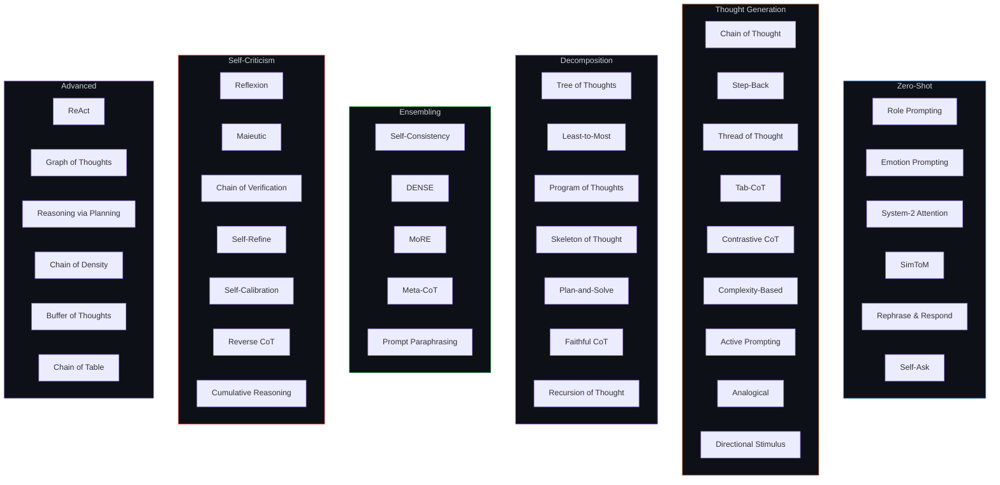
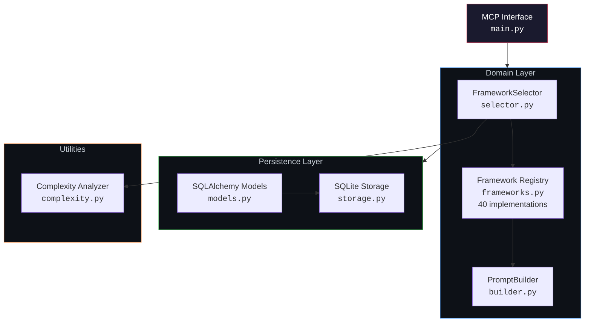

# PromptCore

**Reasoning as a Service**

<!-- INSERT: hero-banner.png — Dark-themed banner with "PromptCore" wordmark, tagline "Reasoning as a Service", and a subtle neural-graph background pattern. Dimensions: 1280x640. -->

[](https://www.python.org/)
[](LICENSE)
[](https://modelcontextprotocol.io/)
[](#framework-catalog)
[](#)

An MCP server that analyzes any task, selects the optimal reasoning framework from 40 peer-reviewed strategies, and generates a tailored meta-prompt -- ready to feed to any LLM. No LLM calls required for selection. Deterministic. Sub-millisecond.

---

## The Problem

Most AI agents use Chain of Thought for everything. That's like using a hammer for every job.

A code generation task needs a different reasoning strategy than a research synthesis task, which needs a different strategy than a logic puzzle. The academic literature describes over 40 distinct reasoning frameworks -- each optimized for specific task types and complexity levels. But no developer has time to read 40 papers and manually select the right one for every prompt.

PromptCore encodes that expertise into a single tool call.

---

## How It Works


**Three steps, one tool call:**

1. **Send your task** -- PromptCore analyzes category (code, math, logic, creative, research, data, planning), complexity (0--10), and intent (17 types including decomposition, verification, exploration)
2. **Framework selected** -- Heuristic scoring matches your task against 40 peer-reviewed reasoning strategies, selecting the one with the highest fit
3. **Meta-prompt returned** -- A structured prompt, built on the selected framework's methodology, ready to feed to any LLM

No LLM calls. No API keys for selection. Runs in under 1ms.

---

## Quick Demo

```python
from promptcore.domain import FrameworkSelector, PromptBuilder

selector = FrameworkSelector()
analysis = selector.analyze("Write a recursive function to calculate fibonacci numbers")

print(analysis.category)               # CODE
print(analysis.complexity_score)       # 3.3
print(analysis.recommended_framework)  # program_of_thoughts
```

```
Task: "Write a recursive function to calculate fibonacci numbers"

  Category:    CODE
  Complexity:  3.3 / 10
  Framework:   Program of Thoughts
  Meta-prompt:
    "Approach this problem by expressing your reasoning as executable code.
     Break the task into computational steps:
     1. Define the problem as a function signature
     2. Identify the base cases and recursive structure
     3. Express the logic as working code with comments explaining each decision
     4. Verify correctness by tracing through example inputs
     ..."
```

Compare that to a naive prompt ("Write a fibonacci function") or a blanket Chain of Thought ("Think step by step..."). PromptCore selects *Program of Thoughts* because the task is code-category with moderate complexity -- a framework specifically designed for tasks where reasoning is best expressed as executable logic.

---

## Framework Catalog

PromptCore includes 40 reasoning frameworks from published research, organized into six categories.



<details>
<summary><strong>Full Framework Reference Table (40 frameworks)</strong></summary>

| Framework | Best For | Complexity Threshold |
|-----------|----------|---------------------|
| Role Prompting | Creative, General, Research | 1.0 |
| Emotion Prompting | Creative, General | 1.0 |
| Rephrase and Respond | General, Research | 2.0 |
| Chain of Thought | Math, Logic, Code | 2.0 |
| System 2 Attention | Logic, Research, General | 3.0 |
| Thread of Thought | Research, Data, General | 3.0 |
| Tab-CoT | Data, Math, Logic | 3.0 |
| Directional Stimulus | Creative, General | 3.0 |
| Skeleton of Thought | Creative, General, Planning | 3.0 |
| Self-Calibration | Math, Logic, General | 3.0 |
| Chain of Density | Research, Data, General | 3.0 |
| Prompt Paraphrasing | General, Logic | 3.0 |
| Sim-to-M | Logic, General | 4.0 |
| Self-Ask | Research, Logic, General | 4.0 |
| Step Back | Research, Logic, General | 4.0 |
| Analogical | General, Creative, Code | 4.0 |
| Program of Thoughts | Math, Code, Data | 4.0 |
| Plan and Solve | Planning, Code, Math | 4.0 |
| Self-Consistency | Math, Logic | 4.0 |
| Self-Refine | Creative, Code, General | 4.0 |
| Chain of Table | Data | 4.0 |
| Least to Most | Code, Math, Planning | 5.0 |
| Contrastive CoT | Math, Logic, Code | 5.0 |
| Active Prompting | General, Research, Logic | 5.0 |
| Faithful CoT | Math, Logic, Code | 5.0 |
| Demonstration Ensembling | General, Data, Logic | 5.0 |
| Maieutic | Research, Logic, General | 5.0 |
| Chain of Verification | Research, General, Data | 5.0 |
| Reverse CoT | Math, Logic, Code | 5.0 |
| Buffer of Thoughts | General, Math, Code | 5.0 |
| Complexity-Based | Math, Logic | 6.0 |
| Tree of Thoughts | Creative, Planning, Research | 6.0 |
| Mixture of Reasoning | General, Research, Logic | 6.0 |
| Meta-CoT | Logic, Math, Research | 6.0 |
| Cumulative Reasoning | Logic, Math, Research | 6.0 |
| Recursion of Thought | Math, Code, Logic | 7.0 |
| ReAct | Research, Code, Data | 7.0 |
| Reflexion | Code, Math, Logic | 8.0 |
| Graph of Thoughts | Planning, Research, Logic | 8.0 |
| Reasoning via Planning | Planning, Logic, Code | 8.0 |

</details>

---

## MCP Tools

| Tool | Description |
|------|-------------|
| `recommend_strategy` | Analyze a task and recommend the optimal reasoning framework with category, complexity, and intent breakdown |
| `generate_meta_prompt` | Generate a structured meta-prompt using the selected framework |
| `log_execution_feedback` | Record feedback about prompt effectiveness for analytics |
| `list_available_frameworks` | Enumerate all 40 frameworks with metadata |
| `get_usage_stats` | Query usage statistics and framework effectiveness trends |

---

## Architecture



```
src/promptcore/
├── main.py              # MCP server entry point (FastMCP, stdio transport)
├── domain/
│   ├── frameworks.py    # 40 reasoning framework implementations
│   ├── selector.py      # Task analysis: category, complexity, intent, framework scoring
│   └── builder.py       # Meta-prompt assembly from framework templates
├── persistence/
│   ├── models.py        # SQLAlchemy + Pydantic models (ReasoningLog)
│   └── storage.py       # SQLite operations for traces and analytics
└── utils/
    └── complexity.py    # Text complexity analysis (token count, keywords, ambiguity)
```

### Security-Aware Task Categorization

PromptCore's category detection layer ensures that adversarial or ambiguous prompts are routed to appropriate reasoning frameworks. Tasks with mixed signals (e.g., a prompt that looks like code but contains social engineering patterns) are scored conservatively -- defaulting to frameworks with built-in verification steps (Chain of Verification, Self-Calibration) rather than naive execution frameworks. This makes PromptCore a safer default for agent pipelines processing untrusted user input.

---

## Installation

```bash
# 1. Clone
git clone https://github.com/BlinkVoid/PromptCore.git
cd PromptCore

# 2. Install dependencies
uv sync

# 3. Run the MCP server
uv run python -m promptcore.main
```

**Requirements:** Python 3.10+, [uv](https://docs.astral.sh/uv/)

---

## MCP Configuration

Add PromptCore to your MCP client. Works with Claude Code, Cline, Continue, Cursor, and any MCP-compatible agent.

### Claude Code / Cline (`.mcp.json` in project root)

```json
{
  "mcpServers": {
    "promptcore": {
      "command": "uv",
      "args": ["run", "--directory", "/path/to/PromptCore", "python", "-m", "promptcore.main"],
      "env": {
        "PYTHONPATH": "/path/to/PromptCore/src",
        "UV_LINK_MODE": "copy",
        "FASTMCP_SHOW_STARTUP_BANNER": "false"
      }
    }
  }
}
```

### Claude Desktop (`claude_desktop_config.json`)

```json
{
  "mcpServers": {
    "promptcore": {
      "command": "uv",
      "args": ["run", "--directory", "/path/to/PromptCore", "python", "-m", "promptcore.main"],
      "env": {
        "PYTHONPATH": "/path/to/PromptCore/src"
      }
    }
  }
}
```

---

## Integration Examples

### From Another MCP-Enabled Agent

```python
# Any MCP client can call PromptCore as a tool
result = mcp_call("promptcore", "generate_meta_prompt", {
    "task": "Analyze the trade-offs between microservices and monolith for a fintech startup",
    "context": "The team has 4 engineers and needs to ship in 3 months"
})

# Feed the optimized prompt to any LLM
response = llm.generate(result["meta_prompt"])
```

### Programmatic Usage (Direct Import)

```python
from promptcore.domain import FrameworkSelector, PromptBuilder

selector = FrameworkSelector()
builder = PromptBuilder()

# Analyze
analysis = selector.analyze("Design a distributed cache invalidation strategy")
print(f"Category: {analysis.category}")                # PLANNING
print(f"Complexity: {analysis.complexity_score}")       # ~7.2
print(f"Framework: {analysis.recommended_framework}")   # reasoning_via_planning

# Generate
result = builder.build(analysis.task, analysis=analysis)
print(result.meta_prompt)  # Structured prompt using Reasoning-via-Planning methodology
```

### In an Agent Pipeline

```python
# Middleware pattern: enhance every LLM call with optimal reasoning
def enhanced_llm_call(task: str, context: str = "") -> str:
    # Step 1: Get optimal reasoning strategy
    strategy = mcp_call("promptcore", "recommend_strategy", {"task": task})

    # Step 2: Generate meta-prompt
    prompt = mcp_call("promptcore", "generate_meta_prompt", {
        "task": task,
        "context": context,
        "framework": strategy["recommended_framework"]
    })

    # Step 3: Execute with any LLM
    result = llm.generate(prompt["meta_prompt"])

    # Step 4: Log feedback for analytics
    mcp_call("promptcore", "log_execution_feedback", {
        "log_id": prompt["log_id"],
        "feedback": "success",
        "notes": "Output matched expected format"
    })

    return result
```

---

## How Does PromptCore Compare?

PromptCore is not the only approach to prompt optimization. See [docs/COMPARISON.md](docs/COMPARISON.md) for detailed comparisons against DSPy (Stanford), PromptFlow (Microsoft), LangChain Templates, manual engineering, and interactive playgrounds -- including an honest assessment of where each approach wins.

**The short version:** PromptCore is the only tool that provides automatic, zero-LLM-cost framework selection from a curated library of 40 peer-reviewed strategies, exposed as MCP tools. If you need LLM-in-the-loop optimization, use DSPy. If you need a visual workflow, use PromptFlow. If you want drop-in reasoning enhancement for agent pipelines, use PromptCore.

---

## Contributing

Contributions are welcome. See [CONTRIBUTING.md](CONTRIBUTING.md) for setup instructions and guidelines.

**Areas where contributions would have the most impact:**
- New reasoning framework implementations (with paper citations)
- Improved complexity scoring heuristics
- Benchmark results validating framework selection quality
- Integrations with additional MCP clients

---

## License

[MIT](LICENSE)

---

<p align="center">
  Built by <a href="https://github.com/BlinkVoid">BlinkVoid</a>
</p>
